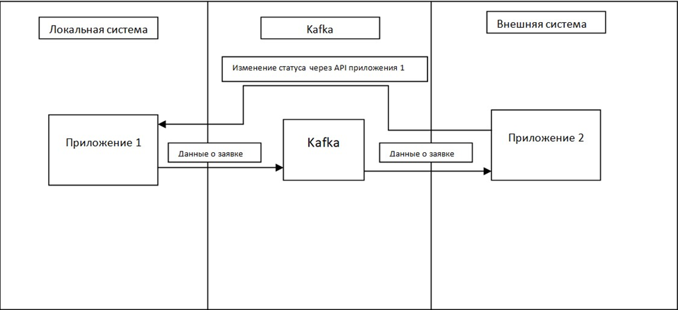
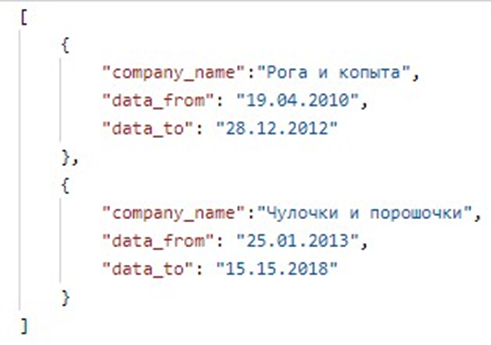

Task requirements:
 
Local system
1. Deploy Camunda on port 9090. To realize:
a. API for changing the process status by request number. API Requirements:
i. POST method
ii. /status/{appNumber}/{statusValue}/, where appNumber is the application number, and statusValue – the status value
iii. Implement validations:
1. Checking the validity of statusValue – must have a value canceled or approved
2. Verifying the existence of a process with appNumber
b. Kafka-producer for sending messages to kafka in the topic recruitment_app.
c. Create a bpmn schema where the business process "Selection" will be implemented personnel"(recruitment.bpmn). The business process should implement:
i. The process is initiated by an HR specialist. Create in the admin panel Camunda of the corresponding user. The HR specialist fills out the form the following fields in the application form:
1. Candidate's full name (String)
2. Application number (int) (unique, but not UUID)
3. Date of birth (Data)
4. Stage (int)
5. Past jobs (JSON). Format:
ii. After sending an application by an hr specialist, the application is sent to send it to the HR manager with the "in_work" status. Create in the Camunda admin panel of the corresponding user. HR Manager
sees the following fields:
1. Candidate's full name (String)
2. Application number (int) (unique, but not UUID)
3. Date of birth (Data)
4. Length of service (int)
5. Past jobs (JSON).
iii. The HR manager can approve (approved) or reject the candidate. At the same time, in the corresponding field the application status changes to the value of the decision made. The manager, guided by his inner impulse, can delegate decision-making to an external system. List of fields,
which must be passed to the external system:
1. Candidate's full name (String)
2. Application number (int) (unique, but not UUID)
3. Date of birth (Data)
4. Stage (int)
5. Past jobs (JSON).
iv. If the application goes to an external system for consideration, then the application must be submitted to the external system.
the status is set to "delegate_in_other_system". At the same time, an HR specialist
can view data on the request.
v. When changing the status from an external system, the HR specialist must: see the result based on their request.
External system
1. Deploy Camunda on port 7070. To realize:
a. Kafka-consumer that should listen to the kafka service. If you received it message to the recruitment_app topic. If there is a message, run the "Security Check" process( security.bpmn)
b. The"Security Check" process:
i.The process participant is a security officer. Create in the admin panel the corresponding user.
ii. At the start of the process, the request status is "in_work".
 
iii. Process data that should come from Kafka:
1.	Candidate's full name (String)
2.	Application number (int) (unique, but not UUID)
3.	Date of birth (Data)
4.	Stage (int)
5.	Past jobs (JSON).
iv. The security officer makes a decision on the application. Application it may be approved, or it may be refused.
v. For any decision made, you must use the API local system to change the status. After that, the process is completed.

